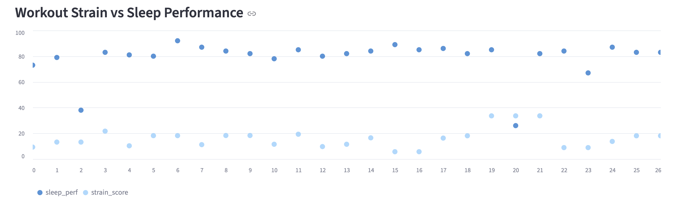
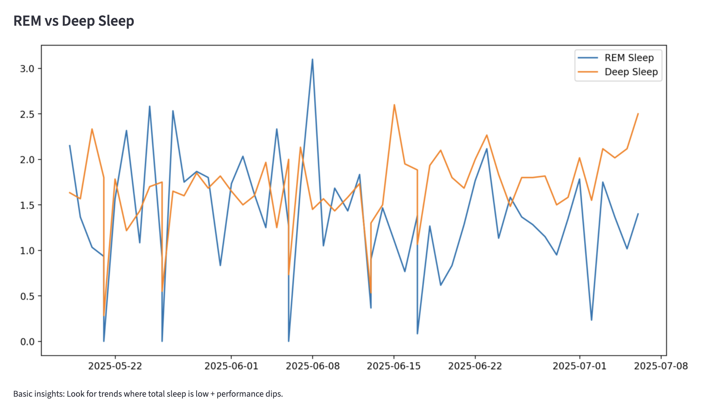
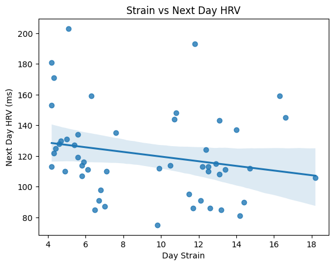
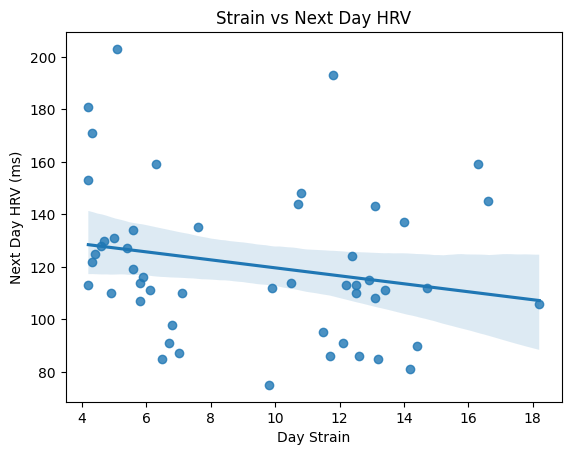
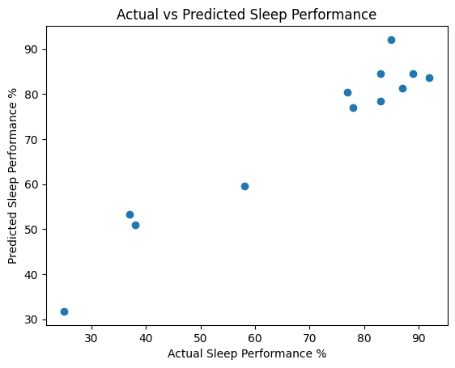
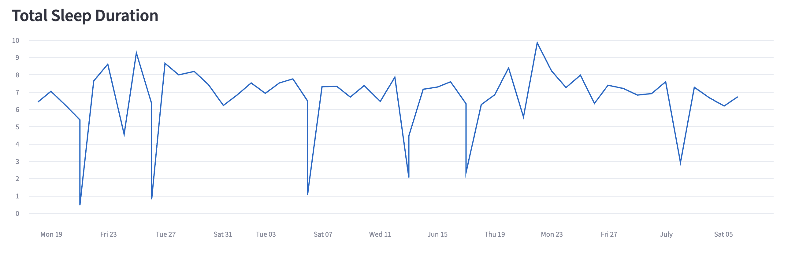

# WHOOP Wearable Recovery Dashboard 📊💙

This is an interactive data analysis project using my real WHOOP data.  
It explores how my daily training **strain** and workouts affect my **sleep quality**, **sleep stages**, and **next-day HRV**, to understand the readiness loop that WHOOP measures for athletes and everyday users.

---

## 🧠 About WHOOP

[WHOOP](https://www.whoop.com/) is a wearable device designed to help athletes and health-conscious individuals optimize recovery, sleep, and performance. It continuously tracks metrics like strain, sleep stages, heart rate variability (HRV), and more—offering personalized insights into how your body responds to training and rest.

This dashboard analyzes WHOOP data to explore how daily strain impacts sleep quality, HRV, and overall recovery.

---

## 🚀 **Project Overview**

🔍 **Goal:**  
- Combine multiple WHOOP datasets: **Sleep**, **Workouts/Strain**, and **Physiological Cycles (HRV)**
- Analyze how **training load** impacts **recovery**
- Build visualizations for trends, rolling averages, and correlations
- Package it all in a **Streamlit dashboard** so it feels like a real athlete-facing app

---

## 🗂️ **What’s included**

```
📁 /data/
├── sleeps.csv                  ← Exported WHOOP sleep data
├── workouts.csv                ← Daily training strain and energy metrics
├── physiological_cycles.csv    ← HRV and menstrual cycle exports

📁 /notebooks/
├── wearable_sleep_analysis.ipynb     ← Exploratory analysis & visuals
├── sleep_ml.ipynb                    ← Sleep performance prediction model

📁 /app/
├── sleep_dashboard.py                ← Streamlit dashboard interface

📁 /screenshots/
├── rem_vs_deep_sleep.png
├── strain_vs_sleep_perf.png
...

📝 README.md                   ← Project overview & usage
📄 requirements.txt            ← Python dependencies
```


---

## 📊 Feature Glossary

| Feature Name            | Description                                                     | Example Value | Units / Scale       |
|------------------------|------------------------------------------------------------------|---------------|---------------------|
| `strain_score`         | WHOOP’s exertion metric based on cardiovascular load             | 16.0          | Scale of 0–21       |
| `sleep_perf`           | Overall sleep performance score based on duration & quality      | 83.0          | Scale of 0–100%     |
| `hrv_next`             | Morning Heart Rate Variability following a workout               | 115           | Milliseconds (ms)   |
| `rem_min` / `deep_min` | Duration of REM / Deep sleep stages                              | 90 / 105      | Minutes             |
| `cycle_phase`          | Menstrual cycle classification (`Follicular`, `Luteal`, etc.)    | Follicular    | Categorical         |
| `sleep_efficiency`     | Ratio of sleep time vs time in bed                               | 92.1          | Percent (%)         |
| `strain_category`      | Binned version of strain score (`Low`, `Moderate`, `High`)        | Moderate      | Categorical         |

---

## ⚙️ **Key features**

✅ Import & clean **sleep**, **workouts**, and **HRV**  
✅ Create **daily strain score** from multiple workouts  
✅ Shift HRV data to next-day for true readiness insight  
✅ Visualize:
- Strain vs **Sleep Performance %**

- Strain vs **REM** or **Deep Sleep**

- Strain vs **Next Day HRV**
  
- **Calories burned** vs Sleep metrics
✅ Build rolling averages to see trends over weeks  
✅ Interactive **Streamlit app** with tabs for:
  - **Sleep Trends**
  - **Readiness Prediction**
  - **Strain vs Recovery**

---

## 🚀 Live Demo

Explore the interactive dashboard here:  
👉 [wearable-dashboard.streamlit.app](https://wearable-dashboard-nitfqisrqchcd2sizgzdzg.streamlit.app/)

---

## 📈 **Example questions answered**

💡 How does a high strain day affect my REM or Deep Sleep? 


💡 Does burning more calories help or hurt my sleep quality?

💡 Does today’s strain impact my HRV tomorrow?  


💡 How do rolling averages reveal patterns hidden in daily noise?

---

## 📈 Sleep Performance Prediction Model

| Metric | Value |
|--------|-------|
| **Mean Squared Error (MSE)** | 57.48 |
| **R² Score**                 | 0.89  |

> 🧠 MSE reflects the average squared error between predicted and actual sleep scores (lower is better).  
> 📊 R² shows the proportion of variance explained—your model captures 89% of the signal in sleep performance!

> 
---

## 📉 Actual vs Predicted Sleep Performance

The scatter plot below compares predicted sleep performance scores to actual values in the test set. Strong clustering around the diagonal line indicates predictive accuracy.



---

## 🔍 What I Found

- Higher daily strain scores were consistently associated with reduced REM and Deep sleep, suggesting that intense exertion may limit overnight recovery.
- Sleep performance tended to improve on days with lower strain, especially when paired with longer total sleep durations.
- Heart Rate Variability (HRV) dropped following high-strain days, indicating delayed physiological recovery.
- Cycle phase appeared to influence recovery patterns: during the follicular phase, HRV was more resilient to strain, while luteal phase responses showed greater variability.
- Sleep duration and performance were positively correlated, but not perfectly—highlighting the importance of sleep quality, not just quantity.
- A linear regression model predicted sleep performance with R² = 0.89 and MSE = 57.48, indicating a strong signal in stage-level sleep metrics.

> These insights helped me explore how training and recovery interact day to day, and gave me hands-on experience with building reproducible pipelines around wearable data.

---

## 🖥️ Dashboard Preview

Explore the visuals from the app in action:

 


---

## 🧩 **Key tools & skills**

- **Python**, **pandas**, **NumPy** — data cleaning & transformation
- **Matplotlib**, **Streamlit** — visualizations & interactive dashboards
- **scikit-learn** — simple regression for predicting readiness scores
- **Time-series merging & rolling averages** — handling physiological signals
- **Sports tech domain knowledge** — readiness, HRV, strain, recovery

---

## 🎓 **What I learned**

- How to handle **real-world messy wearable data** exports (CSV)
- How to align daily strain and next-day HRV for proper cause-effect
- How to turn raw data into clear, actionable **insights** an athlete or coach can use
- How to build a **mini-version** of a real wearable recovery model like WHOOP or Oura’s

---


## 🖥️ Try It Yourself

Click below to explore the dashboard without installing anything: 
👉 [wearable-dashboard.streamlit.app](https://wearable-dashboard-nitfqisrqchcd2sizgzdzg.streamlit.app/)

---

## 🚀 **How to run**

- 1️⃣ Clone this repo and create a Python environment  
- 2️⃣ Install dependencies:
pip install pandas matplotlib scikit-learn streamlit
- 3️⃣ Run the Streamlit app:
streamlit run sleep_dashboard.py
- 4️⃣ Upload your own sleeps.csv, workouts.csv, and physiological_cycles.csv
(or use sample data if you don’t have WHOOP)


---

